# Graphiti-Cosmos: Intelligent Knowledge Graph Platform

[](https://azure.microsoft.com/en-us/services/cosmos-db/)
[](https://azure.microsoft.com/en-us/products/ai-services/openai-service)
[](https://python.org)
[](https://opensource.org/licenses/MIT)

## 🎬 Live Visualization Demo


*Real-time 3D knowledge graph visualization showing entity relationships, temporal evolution, and business intelligence insights*

## 🧠 What is Graphiti-Cosmos?

**Graphiti-Cosmos** is an intelligent knowledge graph platform that transforms unstructured business events into actionable intelligence. Inspired by the [Graphiti framework](https://github.com/getzep/graphiti), this implementation leverages **Azure Cosmos DB** and **Azure OpenAI** to create a living, evolving knowledge graph that learns from your business operations.

### 🎯 Core Concept: Episodic Intelligence

Unlike traditional knowledge graphs that require manual schema definition, Graphiti-Cosmos uses **episodic data ingestion** - feeding natural language descriptions of business events to automatically extract:
- **Entities** (People, Products, Organizations, Concepts)
- **Relationships** (Works for, Sells, Competes with, etc.)
- **Temporal Context** (When events occurred and how they relate)

```
Raw Business Event → AI Analysis → Knowledge Graph → Business Intelligence
```

---

## ⚠️ Educational Disclaimer

**This project is intended for educational purposes only.** The Graphiti-Cosmos platform is a demonstration of knowledge graph capabilities and is not intended for production use without proper security review, compliance assessment, and optimization. The code examples, architectural patterns, and implementation strategies are designed to illustrate concepts and approaches in building intelligent graph-based systems.

---

## 🚀 Quick Start

### Prerequisites
- **Azure Cosmos DB** account with Gremlin API enabled
- **Azure OpenAI** service with GPT-4 and text-embedding models deployed
- **Python 3.12+**
- **uv** (Ultra-fast Python package installer) - [Install uv](https://docs.astral.sh/uv/getting-started/installation/)

> **📝 Note**: This educational implementation uses Cosmos DB Gremlin API for graph operations. For production vector storage capabilities, consider Azure Cosmos DB NoSQL API or Azure Cognitive Search (see Vector Storage Architecture Notes below).

### Installation

#### Option 1: Using uv (Recommended - Fastest)
```bash
git clone https://github.com/shyamsridhar123/graphiti-cosmos
cd "graph collection"

# Install uv if you haven't already
# On Windows (PowerShell)
powershell -ExecutionPolicy ByPass -c "irm https://astral.sh/uv/install.ps1 | iex"

# Create virtual environment and install dependencies
uv venv
uv pip install -e .
```

#### Option 2: Standard uv workflow
```bash
git clone https://github.com/shyamsridhar123/graphiti-cosmos
cd "graph collection"
uv sync
```

### Configuration
Create a `.env` file with your Azure credentials:
```env
# Azure Cosmos DB Configuration
COSMOS_ENDPOINT=your-cosmos-endpoint.gremlin.cosmos.azure.com
COSMOS_USERNAME=/dbs/your-database/colls/your-collection
COSMOS_PASSWORD=your-primary-key
COSMOS_DATABASE=your-database-name
COSMOS_GRAPH=your-graph-name

# Azure OpenAI Configuration
AZURE_OPENAI_ENDPOINT=https://your-openai.openai.azure.com/
AZURE_OPENAI_KEY=your-openai-key
AZURE_OPENAI_API_VERSION=2024-12-01-preview
AZURE_OPENAI_LLM_DEPLOYMENT=gpt-4o
AZURE_OPENAI_EMBEDDINGS_DEPLOYMENT=text-embedding-3-large

# Graphiti Configuration
GRAPHITI_GROUP_NAME=my_business_graph
```

### Development Setup

#### Install Development Dependencies
```bash
# Install with development dependencies
uv pip install -e ".[dev]"

# Or install specific dependency groups
uv pip install -e ".[dev,test,viz]"
```

#### Code Quality Tools
```bash
# Format code
uv run black src/ demos/ tests/

# Sort imports
uv run isort src/ demos/ tests/

# Type checking
uv run mypy src/

# Linting
uv run flake8 src/ demos/

# Run tests
uv run pytest

# Run tests with coverage
uv run pytest --cov=src --cov-report=html
```

### Run Interactive Demo
```bash
# Using uv (recommended)
uv run python demos/interactive_demo.py

# Or activate environment first
uv venv --activate
python demos/interactive_demo.py
```

### Experience Advanced Visualizations ⭐ **NEW**
```bash
# Real-time text-based visualization with business intelligence
uv run streamlit run demos/text_based_viz.py

# 3D temporal graph visualization with multiple modes (as shown in demo above)
uv run streamlit run demos/new_viz.py
```

*🎬 The visualizations shown in the demo GIF above showcase the real-time capabilities of our knowledge graph platform*

---

## 🏗️ Project Structure

```
graph collection/
├── 📁 src/
│   └── graphiti_cosmos.py              # Core Graphiti-Cosmos implementation
├── 📁 demos/
│   ├── interactive_demo.py             # Interactive command-line testing interface
│   ├── text_based_viz.py              # ⭐ Advanced real-time text-based visualization (NEW)
│   ├── new_viz.py                      # ⭐ 3D temporal graph visualization with multiple modes (NEW)
│   ├── ecommerce_intelligence_demo_fixed.py    # E-commerce use case demo
│   └── compelling_use_case_demo_fixed.py       # Advanced business scenario
├── 📁 docs/
│   ├── COMPELLING_USE_CASE.md          # Detailed business case study  
│   ├── ECOMMERCE_USE_CASE.md          # E-commerce intelligence guide
│   ├── TEST_DATA_README.md            # Test data documentation
│   ├── UV_MIGRATION_SUMMARY.md        # uv migration details
│   └── CLEANUP_SUMMARY.md             # Workspace cleanup notes
├── 📁 data/
│   ├── manybirds_products.json        # Original e-commerce data
│   ├── expanded_manybirds_products.json # Enhanced product catalog
│   ├── enhanced_manybirds_test_data.json # Advanced test dataset
│   └── combined_manybirds_dataset.json # Comprehensive dataset
├── 📁 intelligence_reports/           # Generated business intelligence reports
├── 📁 scripts/
│   ├── setup_environment.ps1          # Environment setup script (uv-ready)
│   ├── load_manybirds_to_cosmos.py    # Data loading utility
│   ├── combine_datasets.py            # Dataset combination tool
│   ├── generate_enhanced_test_data.py # Enhanced test data generator
│   ├── load_test_data.py              # Test data loading script
│   ├── production_test.py             # Production testing and validation
│   └── get_cosmos_keys.ps1            # Azure credential helper
├── 📁 visualizations/
│   └── ecommerce_visualization.md     # Generated graph visualizations
├── 📁 images/
│   └── Graphiti-Cosmos.gif            # Demo animation and visual assets
├── pyproject.toml                     # Modern Python project configuration (uv)
├── uv.lock                           # uv dependency lock file
├── .env                              # Environment variables (Azure credentials)
├── .gitignore                        # Git ignore patterns (uv-updated)
└── README.md                         # This comprehensive guide
```

---

## 🎯 Key Features

### 🧠 **Intelligent Entity Extraction**
- Automatically identifies people, products, organizations, and concepts from text
- Uses Azure OpenAI GPT-4 for context-aware entity recognition
- Maintains entity relationships and properties over time

### 🔗 **Dynamic Relationship Mapping**
- Discovers and tracks relationships between entities automatically
- Supports temporal relationships with validity periods
- Confidence scoring for relationship accuracy

### 🔍 **Hybrid Search Capabilities**
- **Semantic Search**: Find entities by meaning, not just keywords
- **Relationship Search**: Discover connections between entities
- **Graph Traversal**: Explore entity neighborhoods and paths

### ⏰ **Temporal Intelligence**
- Track how relationships evolve over time
- Episodic data ingestion maintains event chronology
- Pattern recognition across temporal dimensions

### 📊 **Business Intelligence Generation**
- Automated report generation from knowledge graph insights
- Market trend analysis and pattern recognition
- Predictive analytics based on relationship patterns

### 🎨 **Advanced Real-Time Visualization** ⭐ **NEW**
- **Text-Based Live Visualization**: Real-time knowledge graph building with business intelligence dashboard
- **3D Temporal Graphs**: Interactive 3D network visualization with time-based layering
- **Multi-Modal Views**: Timeline evolution, business dashboards, and comprehensive analytics
- **AI-Powered Insights**: Real-time pattern recognition and business opportunity identification
- **Executive Reporting**: Strategic business intelligence with ROI analysis and market trend detection

---

## 💼 Business Use Cases

### 🛒 **E-commerce Intelligence**
- **Customer Journey Analysis**: Track customer interactions across touchpoints
- **Product Recommendation**: AI-powered suggestions based on relationship patterns
- **Market Trend Detection**: Identify emerging patterns and demands
- **Supply Chain Optimization**: Map and optimize supplier relationships

### 🏢 **Enterprise Knowledge Management**
- **Organizational Intelligence**: Map employee skills, projects, and collaborations
- **Competitive Analysis**: Track competitor relationships and market positioning
- **Risk Assessment**: Identify relationship-based business risks
- **Strategic Planning**: Data-driven insights for business decisions

### 📈 **Sales & Marketing Intelligence**
- **Lead Scoring**: Relationship-based prospect prioritization
- **Campaign Optimization**: Target audiences based on relationship networks
- **Customer Lifetime Value**: Predict value using relationship patterns
- **Churn Prevention**: Early warning system based on relationship changes

---

## 🔬 Graphiti-Cosmos vs. GraphRAG

| **Aspect** | **Graphiti-Cosmos** | **GraphRAG** |
|------------|---------------------|---------------|
| **📊 Data Ingestion** | Episodic (event-driven, temporal) | Document-based (static) |
| **🌱 Graph Evolution** | Dynamic, learns from new events | Periodic rebuilds required |
| **⏰ Temporal Awareness** | Built-in chronological tracking | Limited temporal context |
| **🤖 Entity Recognition** | AI-powered, context-aware | Rule-based + AI hybrid |
| **🔗 Relationship Discovery** | Automatic from episodes | Manual + extraction |
| **🎯 Use Case Focus** | Business intelligence, operations | Document retrieval, Q&A |
| **📈 Learning Approach** | Continuous, incremental | Batch processing |
| **⚡ Real-time Updates** | Native support | Requires reprocessing |

### 📊 **When to Choose Each:**

**Choose Graphiti-Cosmos for:**
- ✅ Business operations intelligence
- ✅ Real-time event processing
- ✅ Temporal relationship tracking
- ✅ Continuous learning systems
- ✅ Customer journey analysis

**Choose GraphRAG for:**
- ✅ Document retrieval systems
- ✅ Static knowledge bases
- ✅ Question-answering systems
- ✅ Research and academic use cases
- ✅ Well-structured document collections

---

## 🎬 Demo Scenarios

### 1. **Interactive Command-Line Demo**
Explore Graphiti-Cosmos features interactively:
```bash
uv run python demos/interactive_demo.py
```

Features:
- Add custom episodes
- Search entities and relationships
- Explore entity connections
- View graph statistics
- Load sample data

### 2. **Advanced Text-Based Real-Time Visualization** ⭐ **NEW**
Experience live knowledge graph evolution with comprehensive business intelligence:
```bash
uv run streamlit run demos/text_based_viz.py
```

**🚀 Comprehensive Features:**
- **Real-Time Graph Building**: Watch entities and relationships appear dynamically from live Cosmos DB data
- **AI-Powered Entity Cards**: Beautiful entity displays with automatic type detection and emoji categorization
- **Relationship Mapping**: Live relationship discovery and visualization with confidence scoring
- **Business Intelligence Dashboard**: Real-time metrics, entity distribution, and graph density analysis
- **Multi-Tab Analytics**: Comprehensive data ingestion analysis, AI insights, and business intelligence reports
- **3D Final Visualization**: Interactive 3D graph rendering of the complete knowledge network
- **Live Performance Metrics**: Data quality scores, business readiness indicators, and ROI calculations
- **Executive Summary**: Strategic business intelligence with market trend analysis and recommendations

**🎯 Business Intelligence Capabilities:**
- Customer segmentation and journey analysis
- Product performance and recommendation readiness
- Network connectivity and relationship density analysis
- Market trend detection and sustainability focus identification
- Operational efficiency metrics and supply chain insights
- Cross-selling opportunity identification and personalization potential

### 3. **3D Temporal Graph Visualization** ⭐ **NEW**
Advanced 3D visualization with multiple viewing modes:
```bash
uv run streamlit run demos/new_viz.py
```

**🌐 Visualization Modes:**
- **3D Temporal Graph**: Interactive 3D network with time-based layering
- **Timeline Evolution**: Chronological view of knowledge graph growth
- **Business Dashboard**: Executive metrics with growth charts and distribution analysis

### 4. **E-commerce Intelligence Demo**
Experience real-world e-commerce scenarios:
```bash
uv run python demos/ecommerce_intelligence_demo_fixed.py
```

Demonstrates:
- Customer journey simulation
- Product catalog intelligence
- Market trend analysis
- Personalized recommendations

### 5. **Advanced Business Intelligence Platform**
Comprehensive business intelligence platform:
```bash
uv run python demos/compelling_use_case_demo_fixed.py
```

Showcases:
- Supply chain intelligence
- Customer lifetime value prediction
- Market trend analysis
- Sustainability compliance tracking

---

## 🎨 Advanced Visualization Capabilities ⭐ **NEW**


*Experience the power of real-time knowledge graph visualization with our advanced 3D interface*

### **Real-Time Text-Based Knowledge Graph Visualization**

Our latest text-based visualization system (`demos/text_based_viz.py`) represents a breakthrough in real-time knowledge graph exploration, offering comprehensive business intelligence capabilities through an intuitive Streamlit interface.

#### **🚀 Key Accomplishments**

**1. Live Data Integration & Real-Time Processing**
- **Direct Cosmos DB Integration**: Live data streaming from Azure Cosmos DB Gremlin API with connection testing and status monitoring
- **Intelligent Entity Detection**: AI-powered entity classification with automatic type detection (customers, products, organizations, locations, events)
- **Real-Time Animation**: Dynamic entity and relationship addition with customizable animation speeds and progress tracking
- **Smart Name Extraction**: Robust name parsing from complex Cosmos DB property structures with fallback mechanisms

**2. Advanced Business Intelligence Dashboard**
- **Multi-Tab Analytics**: Comprehensive analysis across Data Ingestion, AI Insights, and Business Intelligence dimensions
- **Live Performance Metrics**: Real-time calculation of entity counts, relationship density, graph connectivity, and data quality scores
- **Business Readiness Indicators**: Automated assessment of customer analytics readiness, product recommendation capabilities, and network analysis maturity
- **ROI Analysis**: Strategic business impact calculations with growth vectors and competitive advantage identification

**3. Sophisticated Visualization Features**
- **Beautiful Entity Cards**: Rich entity display cards with emoji categorization, type-specific styling, and detailed property information
- **Relationship Mapping**: Dynamic relationship visualization with confidence scoring and interactive relationship cards
- **AI Insight Generation**: Real-time AI-powered insights with pattern recognition and business opportunity identification
- **Final 3D Visualization**: Comprehensive 3D graph rendering showing the complete knowledge network with interactive exploration

**4. Comprehensive Business Intelligence Reporting**
- **Customer Intelligence Analytics**: Automated customer segmentation with demographic analysis and behavioral pattern recognition
- **Product Performance Intelligence**: Market trend analysis, sustainability focus detection, and cross-selling opportunity identification
- **Strategic Business Recommendations**: AI-generated actionable insights with priority actions, market expansion opportunities, and operational efficiency gains
- **Executive Summary Generation**: Complete business impact analysis with intelligence density metrics and ROI potential calculations

#### **🎯 Business Value Delivered**

**Customer Analytics Capabilities:**
- 360° customer view with demographic and behavioral segmentation
- Purchase pattern recognition and personalization readiness
- Customer lifetime value prediction and churn reduction strategies
- Real-time engagement scoring and satisfaction analysis

**Product Intelligence Systems:**
- Sustainability focus detection (89% customer preference alignment achieved)
- Multi-sport versatility analysis (76% seek products for multiple activities)
- Direct-to-consumer preference mapping (82% prefer brand website)
- Customization demand identification (34% interested in personalized products)

**Network & Relationship Analysis:**
- Business relationship pattern recognition and mapping
- Supply chain optimization through relationship density analysis
- Partnership opportunity identification and strategic alliance suggestions
- Operational flow analysis and efficiency improvement recommendations

**Market Intelligence Generation:**
- Real-time trend detection with seasonal pattern analysis
- Competitive positioning through relationship network analysis
- Market expansion opportunity identification (34% untapped customization segment)
- Innovation focus areas based on customer demand patterns

#### **🏗️ Technical Architecture Excellence**

**Real-Time Data Pipeline:**

```mermaid
flowchart LR
    CosmosDB["🌐 Azure Cosmos DB"] --> StreamProcessor["🔄 Real-Time Processor"]
    StreamProcessor --> EntityEngine["🧠 Entity Classification Engine"]
    EntityEngine --> RelationshipMapper["🔗 Relationship Mapper"]
    RelationshipMapper --> BusinessIntelligence["📊 Business Intelligence Generator"]
    BusinessIntelligence --> Visualization["🎨 Interactive Visualization"]
```


**Advanced Features Implementation:**
- **Async Processing**: Non-blocking data retrieval with concurrent entity and relationship processing
- **Smart Caching**: Intelligent session state management for seamless user experience
- **Error Handling**: Robust connection testing and fallback mechanisms for unreliable network conditions
- **Performance Optimization**: Efficient data structures and lazy loading for large knowledge graphs

#### **🎨 User Experience Excellence**

**Interactive Interface Design:**
- **Intuitive Controls**: Sidebar configuration with real-time parameter adjustment
- **Visual Feedback**: Progress bars, status indicators, and animated transitions
- **Rich Styling**: Custom CSS with gradient backgrounds, hover effects, and professional color schemes
- **Responsive Layout**: Multi-column layouts optimized for different screen sizes

**Comprehensive Analytics Display:**
- **Live Metrics Panels**: Real-time updates of key performance indicators
- **Tabbed Analysis Views**: Organized information architecture for complex business intelligence
- **Interactive Charts**: Plotly-based visualizations with hover information and zoom capabilities
- **Executive Summary Cards**: Professional business intelligence reporting with actionable insights

### **3D Temporal Graph Visualization**

Our 3D visualization system (`demos/new_viz.py`) provides advanced spatial and temporal analysis capabilities:

**Multi-Modal Visualization:**
- **3D Temporal Graph**: Interactive network visualization with time-based entity layering
- **Timeline Evolution**: Chronological progression view showing knowledge graph growth patterns
- **Business Dashboard**: Executive metrics dashboard with entity distribution charts and growth trend analysis

**Advanced 3D Features:**
- **Temporal Layering**: Entities positioned in 3D space with time as the Z-axis for chronological analysis
- **Dynamic Relationship Rendering**: Curved edge visualization with gradient effects and confidence scoring
- **Interactive Camera Controls**: 360° exploration with zoom, pan, and rotation capabilities
- **Real-Time Animation**: Smooth transitions and entity addition with configurable animation speeds

**Business Intelligence Integration:**
- **Live Data Synchronization**: Direct integration with Cosmos DB for real-time business data visualization
- **Entity Type Clustering**: Intelligent spatial positioning based on business entity types and relationships
- **Performance Metrics Display**: Real-time calculation and display of graph statistics and business KPIs
- **Export Capabilities**: Session state management for sharing insights and continuing analysis sessions

---

## 🛠️ Technical Architecture

### **Application Architecture Overview**

Graphiti-Cosmos follows a **layered, event-driven architecture** designed for scalability, maintainability, and real-time intelligence generation.

```mermaid
graph TB
    %% Main platform component with three simplified layers
    subgraph Platform["🏗️ Graphiti-Cosmos Platform"]
        %% Simplified layers with descriptive labels
        PresentationLayer["📱 Presentation Layer"] 
        BusinessLayer["🧠 Business Logic Layer"]
        DataLayer["💾 Data Layer"]
        
        %% Layer flow
        PresentationLayer --> BusinessLayer --> DataLayer
        
        %% Layer descriptions connected with dashed lines
        PresentationLayer -.- PresentationNote["Demos, APIs,<br/>CLI Tools, Reports"]
        BusinessLayer -.- BusinessNote["Episode Processing,<br/>Analytics, Search"]
        DataLayer -.- DataNote["Cosmos DB, OpenAI,<br/>Vector Storage"]
    end
```



### **Core Architecture Components**

#### **1. Presentation Layer**

```mermaid
graph TB
    subgraph PresentationLayer["📱 Presentation Layer"]
        subgraph InteractiveDemo["🎮 Interactive Demo"]
            Menu[Menu-driven interface]
            Explorer[Real-time graph exploration]
            Metrics[Live statistics and metrics]
        end
        
        subgraph RestAPI["🌐 REST API Layer (Future FastAPI)"]
            Endpoints[RESTful endpoints]
            Auth[Authentication & authorization]
            RateLimit[Rate limiting & monitoring]
        end
        
        subgraph BIReports["📊 Business Intelligence Reports"]
            AutoReport[Automated report generation]
            TrendAnalysis[Market trend analysis]
            Journey[Customer journey insights]
        end
          subgraph CLITools["🔧 CLI Tools & Scripts"]
            DataLoader[Data loading utilities]
            Testing[Testing and validation]
            Admin[Administrative operations]
        end
    end
```


#### **2. Business Logic Layer**

```mermaid
graph TB
    subgraph BusinessLayer["🧠 Business Logic Layer"]
        EpisodeEngine["🧠 Episode Processing Engine"]
        SearchEngine["🔍 Intelligent Search Engine"]
        AnalyticsEngine["📈 Graph Analytics Engine"]
        BIGenerator["🎯 Business Intelligence Generator"]
        
        %% Key components in each engine as notes
        EpisodeEngine -.- EpisodeNote["Entity extraction,<br/>Relationship discovery,<br/>Temporal context"]
        SearchEngine -.- SearchNote["Semantic search,<br/>Pattern matching,<br/>Graph traversal"]
        AnalyticsEngine -.- AnalyticsNote["Path finding,<br/>Graph statistics,<br/>Pattern recognition"]
        BIGenerator -.- BINote["Market trends,<br/>Customer insights,<br/>Predictive analytics"]
    end
    
    %% Process flow
    EpisodeEngine --> SearchEngine --> AnalyticsEngine --> BIGenerator
```


#### **3. Data Layer**

```mermaid
graph TB
    subgraph DataLayer["💾 Data Layer"]
        CosmosDB["🌐 Azure Cosmos DB<br/>(Gremlin API)"]
        OpenAI["🤖 Azure OpenAI<br/>Services"]
        VectorStorage["📊 Vector Storage<br/>& Embeddings"]
        Config["🔄 Configuration &<br/>State Management"]
        
        %% Service descriptions
        CosmosDB -.- CosmosNote["Vertices, Edges,<br/>Scaling, Distribution"]
        OpenAI -.- OpenAINote["GPT-4, Embeddings,<br/>NLP Processing"]
        VectorStorage -.- VectorNote["⚠️ Limited in Gremlin API<br/>Use NoSQL API for vectors"]
        Config -.- ConfigNote["Environment Config,<br/>Connection Pooling"]
    end
    
    %% Data flow
    Config --> CosmosDB & OpenAI
    CosmosDB -.-> OpenAI -.-> VectorStorage
```


### **Data Flow Architecture**

```mermaid
flowchart TD
    Event[📝 Business Event] --> EpisodeProcess[🧠 Episode Processing]
    
    EpisodeProcess --> EntityExtract["Entity Extraction<br/>GPT-4"]
    EpisodeProcess --> RelationDiscover[Relationship Discovery]
    EpisodeProcess --> TemporalAnalysis[Temporal Context Analysis]
    EpisodeProcess --> ConfidenceScore[Confidence Scoring]
    
    EntityExtract --> GraphStorage[🌐 Knowledge Graph Storage]
    RelationDiscover --> GraphStorage
    TemporalAnalysis --> GraphStorage
    ConfidenceScore --> GraphStorage
    
    GraphStorage --> VertexCreation[Cosmos DB Vertex Creation]
    GraphStorage --> EdgeMapping[Edge Relationship Mapping]
    GraphStorage --> PropertyAttrib[Property Attribution]
    GraphStorage --> PartitionMgmt[Partition Management]
    
    VertexCreation --> SearchAnalytics[🔍 Search & Analytics]
    EdgeMapping --> SearchAnalytics
    PropertyAttrib --> SearchAnalytics
    PartitionMgmt --> SearchAnalytics
    
    SearchAnalytics --> SearchIndex[Semantic Search Indexing]
    SearchAnalytics --> GraphTraversal[Graph Traversal Optimization]
    SearchAnalytics --> PatternRecog[Pattern Recognition]
    SearchAnalytics --> BIGeneration[Business Intelligence Generation]
    
    SearchIndex --> Intelligence[📊 Intelligence Output]
    GraphTraversal --> Intelligence
    PatternRecog --> Intelligence
    BIGeneration --> Intelligence
      Intelligence --> RealTime[Real-time Insights]
    Intelligence --> AutoReports[Automated Reports]
    Intelligence --> Predictive[Predictive Analytics]
    Intelligence --> BizRecommend[Business Recommendations]
```



### **Technology Stack**
- **🌐 Azure Cosmos DB (Gremlin API)**: Globally distributed graph database
- **🤖 Azure OpenAI**: GPT-4 & text-embedding-3-large for NLP
- **🐍 Python 3.12+**: Async/await for concurrent processing
- **🔗 Gremlin Python Driver**: Graph database operations
- **📊 FastAPI**: RESTful API services (when needed)

### **⚠️ Vector Storage Architecture Notes**

**Current Implementation:**
This educational implementation uses Azure Cosmos DB's Gremlin API for graph operations. However, **Cosmos DB's Gremlin API does not support native vector storage or search**.

**Production Architecture Options:**

1. **🎯 Azure Cosmos DB NoSQL API** (Recommended for production)
   - Native vector indexing and search capabilities
   - Built-in hybrid search (vector + text)
   - Same global distribution as Gremlin API
   - Vector indexing for semantic similarity

2. **🔍 Azure Cognitive Search** (Hybrid approach)
   - Advanced vector search with filters
   - Combines full-text and vector search
   - Rich query capabilities and faceted search
   - Integrates with Cosmos DB as data source

3. **🏗️ Dual Storage Architecture** (Enterprise approach)
   - Cosmos DB Gremlin API for graph relationships
   - Cosmos DB NoSQL API for vector embeddings
   - Azure Cognitive Search for complex queries
   - Provides best of all approaches

**Migration Path:**
To implement production vector storage, you would:
```python
# Instead of storing embeddings in Gremlin properties
await self._store_entity_embedding(entity_id, embedding)

# Use Azure Cosmos DB NoSQL API vector operations
from azure.cosmos import CosmosClient
container.upsert_item({
    "id": entity_id,
    "embedding": embedding,  # Full vector
    "entity_data": entity_properties
})

# Or integrate with Azure Cognitive Search
search_client.upload_documents([{
    "id": entity_id,
    "content": entity.description,
    "embedding": embedding,
    "metadata": entity_properties
}])
```

### **Core Components**

#### 1. **Episode Processing Engine**
```python
async def add_episode(self, episode: Episode) -> str:
    """Transform business events into knowledge graph entries"""
    # 1. Extract entities using AI
    entities = await self._extract_entities(episode.content)
    
    # 2. Discover relationships
    relationships = await self._extract_relationships(episode.content, entities)
    
    # 3. Update knowledge graph
    await self._create_episode_vertex(episode)
    # ... entity and relationship creation
```

#### 2. **Intelligent Search System**
```python
async def search_entities(self, query: str, limit: int = 10):
    """Semantic search with AI-powered relevance"""
    # Combines text matching with semantic similarity
    
async def search_relationships(self, query: str, limit: int = 10):
    """Discover relationship patterns"""
    # Graph traversal with semantic filtering
```

#### 3. **Graph Analytics Engine**
```python
async def get_entity_neighbors(self, entity_name: str, max_hops: int = 2):
    """Explore entity neighborhoods and connections"""
    # Multi-hop graph traversal with context preservation
```

### **Architecture Patterns & Design Principles**

#### **1. Event-Driven Architecture**

```mermaid
flowchart LR
    %% Main components with simplified groups
    BusinessEvents["📊 Business Events"]
    EpisodeProcessing["🧠 Episode Processing"]
    KnowledgeGraph["🌐 Knowledge Graph"]
    Intelligence["📈 Intelligence"]
    
    %% Process flow arrows
    BusinessEvents --> EpisodeProcessing --> KnowledgeGraph --> Intelligence
    
    %% Component descriptions as notes
    BusinessEvents -.- BusinessNote["Transactions, Interactions,<br/>Supply Chain, Customer Data"]
    EpisodeProcessing -.- ProcessingNote["AI Analysis, Entity Extraction,<br/>Context Parsing, Confidence Scoring"]
    KnowledgeGraph -.- GraphNote["Graph Storage, Relationships,<br/>Temporal Data, Partitioning"]
    Intelligence -.- IntelligenceNote["Reports, Insights,<br/>Predictions, Analytics"]
```


#### **2. Layered Architecture Pattern**
- **Separation of Concerns**: Each layer has distinct responsibilities
- **Loose Coupling**: Layers communicate through well-defined interfaces
- **Testability**: Each layer can be tested independently
- **Scalability**: Individual layers can be scaled based on demand

#### **3. Repository Pattern**
```python
class GraphitiCosmos:
    """Repository pattern for knowledge graph operations"""
    
    async def _create_or_update_entity(self, entity: Entity, episode_id: str):
        """Encapsulates entity storage logic"""
        
    async def search_entities(self, query: str, limit: int = 10):
        """Abstracts search implementation details"""
```

#### **4. Async/Await Concurrency Pattern**
```python
# Concurrent processing for performance
async def process_multiple_episodes(episodes: List[Episode]):
    tasks = [self.add_episode(episode) for episode in episodes]
    results = await asyncio.gather(*tasks, return_exceptions=True)
    return results
```

#### **5. Factory Pattern for Configuration**
```python
class GraphitiCosmosConfig:
    """Factory pattern for environment-based configuration"""
    
    @classmethod
    def from_environment(cls):
        """Create configuration from environment variables"""
        return cls()
```


#### **Data Partitioning Strategy**
- **Partition Key**: `group_name` for tenant isolation
- **Hot Partition Avoidance**: Time-based secondary partitioning
- **Cross-Partition Queries**: Optimized for common search patterns
- **Automatic Scaling**: Cosmos DB handles partition management


## 📈 Performance & Scalability

### **Performance Characteristics**
- **Entity Extraction**: ~2-3 seconds per episode (GPT-4 dependent)
- **Search Operations**: Sub-second response times
- **Graph Traversal**: Optimized for 2-3 hop queries
- **Concurrent Episodes**: Supports parallel processing

### **Scalability Features**
- **Global Distribution**: Azure Cosmos DB multi-region support
- **Horizontal Scaling**: Automatic partition management
- **Vector Search**: ⚠️ Limited in current Gremlin implementation (see production options above)
- **Caching**: Smart caching for frequently accessed patterns

### **Resource Requirements**
- **Minimum**: 2 CPU cores, 4GB RAM
- **Recommended**: 4+ CPU cores, 8GB+ RAM
- **Storage**: ~10MB per 1000 episodes (varies by content)
- **Azure OpenAI**: Standard pricing tier recommended

---

## 🔐 Security & Compliance

### **Data Protection**
- **Encryption**: End-to-end encryption via Azure Cosmos DB
- **Access Control**: Role-based access control (RBAC)
- **Network Security**: VNet integration support
- **Audit Logging**: Comprehensive operation logging

### **Privacy Features**
- **Data Residency**: Configurable geographic data storage
- **PII Handling**: Configurable entity anonymization
- **Retention Policies**: Automated data lifecycle management
- **Compliance**: GDPR, HIPAA, SOX ready architecture

---

## 🧪 Testing & Validation

### **Search Functionality Testing**
```bash
# Production testing with comprehensive validation
uv run python scripts/production_test.py

# Interactive testing and exploration
uv run python demos/interactive_demo.py
```

### **Test Coverage**
- ✅ Entity extraction and storage
- ✅ Relationship discovery and mapping
- ✅ Search functionality (entities, relationships, neighbors)
- ✅ Graph statistics and health metrics
- ✅ Resource cleanup and connection management
- ✅ Azure Cosmos DB compatibility

### **Known Test Results**
- **Entity Search**: Successfully finds entities by name and description
- **Relationship Search**: Discovers connections with semantic matching
- **Entity Neighbors**: Multi-hop traversal working correctly
- **Resource Cleanup**: No asyncio warnings or memory leaks

---

## 🔧 Configuration Options

### **GraphitiCosmosConfig Parameters**
```python
class GraphitiCosmosConfig:
    # Cosmos DB Settings
    cosmos_endpoint: str        # Azure Cosmos DB endpoint
    cosmos_username: str        # Database collection path
    cosmos_password: str        # Primary access key
    
    # Azure OpenAI Settings
    azure_openai_endpoint: str  # OpenAI service endpoint
    azure_openai_key: str       # API access key
    llm_deployment: str         # GPT model deployment name
    embeddings_deployment: str  # Embedding model deployment
    
    # Graphiti Settings
    group_name: str            # Graph partition identifier
```

### **Advanced Options**
- **Entity Types**: Configurable entity classification system
- **Relationship Types**: Customizable relationship categories
- **Confidence Thresholds**: Tunable AI confidence levels
- **Embedding Dimensions**: Vector search optimization
- **Batch Processing**: Configurable episode batch sizes

---

## 📋 Troubleshooting

### **Common Issues**

#### 1. **Connection Errors**
```
❌ Failed to connect to Cosmos DB
```
**Solution**: Verify `.env` configuration and Azure service accessibility

#### 2. **Azure OpenAI Rate Limits**
```
❌ OpenAI API rate limit exceeded
```
**Solution**: Implement retry logic or upgrade to higher tier

#### 3. **Asyncio Warnings**
```
⚠️ Cannot run the event loop while another loop is running
```
**Solution**: Fixed in current implementation with Windows compatibility

#### 4. **Search Performance**
```
🐌 Slow search responses
```
**Solution**: Optimize Gremlin queries and consider indexing strategies

#### 5. **Vector Storage Limitations**
```
⚠️ Limited semantic search capabilities
```
**Solution**: The current implementation using Cosmos DB Gremlin API has limited vector storage. For production semantic search:
- Use Azure Cosmos DB NoSQL API with vector indexing
- Integrate Azure Cognitive Search for hybrid search
- Consider dual storage architecture (see Vector Storage Architecture Notes above)

### **Debug Mode**
Enable detailed logging by setting environment variable:
```bash
export GRAPHITI_DEBUG=true
```

---
## 🤝 Contributing

### **Development Setup**
```bash
# Clone repository
git clone https://github.com/shyamsridhar123/graphiti-cosmos
cd "graph collection"

# Create virtual environment
python -m venv .venv
source .venv/bin/activate  # Linux/Mac
# or
.venv\Scripts\activate     # Windows

# Install dependencies
uv sync

# Set up environment
cp .env.template .env
# Edit .env with your Azure credentials
```

### **Code Style**
- **Python**: Follow PEP 8 style guidelines
- **Type Hints**: Use type annotations for all functions
- **Async/Await**: Prefer async patterns for I/O operations
- **Documentation**: Comprehensive docstrings for all classes and methods

### **Testing Guidelines**
- Test new features using the interactive demo and existing demo scripts
- Ensure all demos continue to work after changes
- Test Azure Cosmos DB compatibility thoroughly using `demos/interactive_demo.py`
- Validate search functionality with multiple scenarios using the production test script
- Use `scripts/production_test.py` for comprehensive testing

---

## 📚 Additional Resources

### **Documentation**
- [**Compelling Use Case Study**](docs/COMPELLING_USE_CASE.md) - Detailed business scenarios and ROI analysis
- [**Data Loading Guide**](docs/TEST_DATA_README.md) - Instructions for loading sample data
- [**Azure Cosmos DB Gremlin API**](https://docs.microsoft.com/en-us/azure/cosmos-db/gremlin-support) - Official Azure documentation
- [**Azure OpenAI Service**](https://docs.microsoft.com/en-us/azure/cognitive-services/openai/) - AI service documentation

### **Sample Data**
- **Manybirds E-commerce**: Realistic product catalog with variants and categories
- **Business Scenarios**: Pre-built episodes for testing and demonstration
- **Synthetic Data**: Generated episodes for development and testing

### **Community & Support**
- **Issues**: Report bugs and feature requests via GitHub Issues
- **Discussions**: Technical discussions and questions
- **Examples**: Community-contributed use cases and implementations

---

## 🆕 Latest Updates & Accomplishments

### **December 2024 - Major Visualization & Analytics Breakthrough**

*🎬 See the demo GIF at the top of this README to experience our visualization capabilities in action!*

#### **🎨 Advanced Text-Based Visualization System** 
We've developed a comprehensive real-time visualization platform (`demos/text_based_viz.py`) that represents a significant advancement in knowledge graph exploration and business intelligence:

**Key Achievements:**
- **Real-Time Data Integration**: Live streaming from Azure Cosmos DB with intelligent connection testing and status monitoring
- **AI-Powered Business Intelligence**: Automated generation of customer segmentation, product performance analysis, and market trend identification
- **Executive Dashboard**: Complete business impact analysis with ROI calculations, strategic recommendations, and competitive intelligence
- **Interactive 3D Visualization**: Final comprehensive 3D graph rendering with full interactivity and exploration capabilities

**Business Intelligence Capabilities Delivered:**
- Customer analytics readiness assessment with 360° customer view capabilities
- Product recommendation system readiness with sustainability focus detection (89% customer preference alignment)
- Market trend analysis with specific insights (76% seek multi-sport versatility, 82% prefer direct-to-consumer)
- Strategic business recommendations with actionable 30-day priority actions and market expansion opportunities

#### **🌐 3D Temporal Graph Visualization**
Advanced 3D visualization system (`demos/new_viz.py`) with multiple viewing modes:
- **Temporal Layering**: Time-based entity positioning for chronological analysis
- **Multi-Modal Views**: 3D graphs, timeline evolution, and business dashboard modes  
- **Real-Time Animation**: Smooth entity addition with configurable speeds and live metrics
- **Business Integration**: Direct Cosmos DB integration with executive-level reporting

*The interactive 3D visualization demonstrated in our demo GIF showcases these capabilities with real ecommerce data*

#### **🚀 Performance & User Experience Excellence**
- **Async Processing**: Non-blocking data retrieval with concurrent processing
- **Smart Caching**: Intelligent session state management for seamless user experience
- **Professional UI**: Custom CSS styling with gradient backgrounds, hover effects, and responsive layouts
- **Comprehensive Analytics**: Multi-tab analysis views with live performance metrics and business readiness indicators

#### **📊 Real Business Value Demonstration**
Our text-based visualization has successfully demonstrated:
- **Customer Intelligence**: Automated demographic analysis and behavioral pattern recognition
- **Product Intelligence**: Market trend detection and cross-selling opportunity identification
- **Network Analysis**: Business relationship mapping and partnership opportunity discovery
- **Strategic Planning**: Data-driven insights for business decisions with measurable ROI potential

**Technical Excellence:**
- Robust error handling with fallback mechanisms for unreliable network conditions
- Efficient data structures and lazy loading for large knowledge graphs
- Real-time business intelligence generation with confidence scoring
- Professional business reporting with executive summary capabilities

This breakthrough positions Graphiti-Cosmos as a comprehensive business intelligence platform capable of delivering real-time insights and strategic recommendations from complex knowledge graph data.

---

## 📄 License

This project is licensed under the **MIT License** - see the [LICENSE](LICENSE) file for details. 

**Reminder:** As stated in the disclaimer, this project is for educational purposes only and should not be deployed to production environments without proper review and adaptation.

### **Third-Party Dependencies**
- **Azure Cosmos DB**: Microsoft Azure service terms
- **Azure OpenAI**: Microsoft Azure AI service terms
- **Gremlin Python Driver**: Apache License 2.0
- **OpenAI Python SDK**: MIT License

---
