# Graphiti-Cosmos: Intelligent Knowledge Graph Platform

[](https://azure.microsoft.com/en-us/services/cosmos-db/)
[](https://azure.microsoft.com/en-us/products/ai-services/openai-service)
[](https://python.org)
[](https://opensource.org/licenses/MIT)

## 🧠 What is Graphiti-Cosmos?

**Graphiti-Cosmos** is an intelligent knowledge graph platform that transforms unstructured business events into actionable intelligence. Inspired by the [Graphiti framework](https://github.com/getzep/graphiti), this implementation leverages **Azure Cosmos DB** and **Azure OpenAI** to create a living, evolving knowledge graph that learns from your business operations.

### 🎯 Core Concept: Episodic Intelligence

Unlike traditional knowledge graphs that require manual schema definition, Graphiti-Cosmos uses **episodic data ingestion** - feeding natural language descriptions of business events to automatically extract:
- **Entities** (People, Products, Organizations, Concepts)
- **Relationships** (Works for, Sells, Competes with, etc.)
- **Temporal Context** (When events occurred and how they relate)

```
Raw Business Event → AI Analysis → Knowledge Graph → Business Intelligence
```

---

## ⚠️ Educational Disclaimer

**This project is intended for educational purposes only.** The Graphiti-Cosmos platform is a demonstration of knowledge graph capabilities and is not intended for production use without proper security review, compliance assessment, and optimization. The code examples, architectural patterns, and implementation strategies are designed to illustrate concepts and approaches in building intelligent graph-based systems.

---

## 🚀 Quick Start

### Prerequisites
- **Azure Cosmos DB** account with Gremlin API enabled
- **Azure OpenAI** service with GPT-4 and text-embedding models deployed
- **Python 3.12+**

### Installation
```bash
git clone <repository-url>
cd "graph collection"
pip install -r requirements.txt
```

### Configuration
Create a `.env` file with your Azure credentials:
```env
# Azure Cosmos DB Configuration
COSMOS_ENDPOINT=your-cosmos-endpoint.gremlin.cosmos.azure.com
COSMOS_USERNAME=/dbs/your-database/colls/your-collection
COSMOS_PASSWORD=your-primary-key
COSMOS_DATABASE=your-database-name
COSMOS_GRAPH=your-graph-name

# Azure OpenAI Configuration
AZURE_OPENAI_ENDPOINT=https://your-openai.openai.azure.com/
AZURE_OPENAI_KEY=your-openai-key
AZURE_OPENAI_API_VERSION=2024-12-01-preview
AZURE_OPENAI_LLM_DEPLOYMENT=gpt-4o
AZURE_OPENAI_EMBEDDINGS_DEPLOYMENT=text-embedding-3-large

# Graphiti Configuration
GRAPHITI_GROUP_NAME=my_business_graph
```

### Run Interactive Demo
```bash
python demos/interactive_demo.py
```

---

## 🏗️ Project Structure

```
graph collection/
├── 📁 src/
│   └── graphiti_cosmos.py          # Core Graphiti-Cosmos implementation
├── 📁 demos/
│   ├── interactive_demo.py         # Interactive testing interface
│   ├── ecommerce_intelligence_demo_fixed.py    # E-commerce use case demo
│   ├── compelling_use_case_demo_fixed.py       # Advanced business scenario
│   └── demo_graphiti_cosmos.py     # Basic functionality demo
├── 📁 docs/
│   ├── COMPELLING_USE_CASE.md      # Detailed business case study
│   └── README.md                   # Data loading documentation
├── 📁 data/
│   └── manybirds_products.json     # Sample e-commerce data
├── 📁 config/
│   └── [configuration files]       # Environment configurations
├── 📁 intelligence_reports/        # Generated business intelligence reports
├── test_search.py                  # Basic search functionality tests
├── test_search_enhanced.py         # Advanced search validation
└── README.md                       # This file
```

---

## 🎯 Key Features

### 🧠 **Intelligent Entity Extraction**
- Automatically identifies people, products, organizations, and concepts from text
- Uses Azure OpenAI GPT-4 for context-aware entity recognition
- Maintains entity relationships and properties over time

### 🔗 **Dynamic Relationship Mapping**
- Discovers and tracks relationships between entities automatically
- Supports temporal relationships with validity periods
- Confidence scoring for relationship accuracy

### 🔍 **Hybrid Search Capabilities**
- **Semantic Search**: Find entities by meaning, not just keywords
- **Relationship Search**: Discover connections between entities
- **Graph Traversal**: Explore entity neighborhoods and paths

### ⏰ **Temporal Intelligence**
- Track how relationships evolve over time
- Episodic data ingestion maintains event chronology
- Pattern recognition across temporal dimensions

### 📊 **Business Intelligence Generation**
- Automated report generation from knowledge graph insights
- Market trend analysis and pattern recognition
- Predictive analytics based on relationship patterns

---

## 💼 Business Use Cases

### 🛒 **E-commerce Intelligence**
- **Customer Journey Analysis**: Track customer interactions across touchpoints
- **Product Recommendation**: AI-powered suggestions based on relationship patterns
- **Market Trend Detection**: Identify emerging patterns and demands
- **Supply Chain Optimization**: Map and optimize supplier relationships

### 🏢 **Enterprise Knowledge Management**
- **Organizational Intelligence**: Map employee skills, projects, and collaborations
- **Competitive Analysis**: Track competitor relationships and market positioning
- **Risk Assessment**: Identify relationship-based business risks
- **Strategic Planning**: Data-driven insights for business decisions

### 📈 **Sales & Marketing Intelligence**
- **Lead Scoring**: Relationship-based prospect prioritization
- **Campaign Optimization**: Target audiences based on relationship networks
- **Customer Lifetime Value**: Predict value using relationship patterns
- **Churn Prevention**: Early warning system based on relationship changes

---

## 🔬 Graphiti-Cosmos vs. GraphRAG

| **Aspect** | **Graphiti-Cosmos** | **GraphRAG** |
|------------|---------------------|---------------|
| **Data Ingestion** | Episodic (event-driven, temporal) | Document-based (static) |
| **Graph Evolution** | Dynamic, learns from new events | Periodic rebuilds required |
| **Temporal Awareness** | Built-in chronological tracking | Limited temporal context |
| **Entity Recognition** | AI-powered, context-aware | Rule-based + AI hybrid |
| **Relationship Discovery** | Automatic from episodes | Manual + extraction |
| **Use Case Focus** | Business intelligence, operations | Document retrieval, Q&A |
| **Learning Approach** | Continuous, incremental | Batch processing |
| **Real-time Updates** | Native support | Requires reprocessing |

### 📊 **When to Choose Each:**

**Choose Graphiti-Cosmos for:**
- ✅ Business operations intelligence
- ✅ Real-time event processing
- ✅ Temporal relationship tracking
- ✅ Continuous learning systems
- ✅ Customer journey analysis

**Choose GraphRAG for:**
- ✅ Document retrieval systems
- ✅ Static knowledge bases
- ✅ Question-answering systems
- ✅ Research and academic use cases
- ✅ Well-structured document collections

---

## 🎬 Demo Scenarios

### 1. **Interactive Demo**
Explore Graphiti-Cosmos features interactively:
```bash
python demos/interactive_demo.py
```

Features:
- Add custom episodes
- Search entities and relationships
- Explore entity connections
- View graph statistics
- Load sample data

### 2. **E-commerce Intelligence**
Experience real-world e-commerce scenarios:
```bash
python demos/ecommerce_intelligence_demo_fixed.py
```

Demonstrates:
- Customer journey simulation
- Product catalog intelligence
- Market trend analysis
- Personalized recommendations

### 3. **Advanced Business Intelligence**
Comprehensive business intelligence platform:
```bash
python demos/compelling_use_case_demo_fixed.py
```

Showcases:
- Supply chain intelligence
- Customer lifetime value prediction
- Market trend analysis
- Sustainability compliance tracking

---

## 🛠️ Technical Architecture

### **Application Architecture Overview**

Graphiti-Cosmos follows a **layered, event-driven architecture** designed for scalability, maintainability, and real-time intelligence generation.

```mermaid
graph TB
    %% Main platform component with three simplified layers
    subgraph Platform["🏗️ Graphiti-Cosmos Platform"]
        %% Simplified layers with descriptive labels
        PresentationLayer["📱 Presentation Layer"] 
        BusinessLayer["🧠 Business Logic Layer"]
        DataLayer["💾 Data Layer"]
        
        %% Layer flow
        PresentationLayer --> BusinessLayer --> DataLayer
        
        %% Layer descriptions connected with dashed lines
        PresentationLayer -.- PresentationNote["Demos, APIs,<br/>CLI Tools, Reports"]
        BusinessLayer -.- BusinessNote["Episode Processing,<br/>Analytics, Search"]
        DataLayer -.- DataNote["Cosmos DB, OpenAI,<br/>Vector Storage"]
    end
```



### **Core Architecture Components**

#### **1. Presentation Layer**

```mermaid
graph TB
    subgraph PresentationLayer["📱 Presentation Layer"]
        subgraph InteractiveDemo["🎮 Interactive Demo"]
            Menu[Menu-driven interface]
            Explorer[Real-time graph exploration]
            Metrics[Live statistics and metrics]
        end
        
        subgraph RestAPI["🌐 REST API Layer (Future FastAPI)"]
            Endpoints[RESTful endpoints]
            Auth[Authentication & authorization]
            RateLimit[Rate limiting & monitoring]
        end
        
        subgraph BIReports["📊 Business Intelligence Reports"]
            AutoReport[Automated report generation]
            TrendAnalysis[Market trend analysis]
            Journey[Customer journey insights]
        end
          subgraph CLITools["🔧 CLI Tools & Scripts"]
            DataLoader[Data loading utilities]
            Testing[Testing and validation]
            Admin[Administrative operations]
        end
    end
```


#### **2. Business Logic Layer**

```mermaid
graph TB
    subgraph BusinessLayer["🧠 Business Logic Layer"]
        EpisodeEngine["🧠 Episode Processing Engine"]
        SearchEngine["🔍 Intelligent Search Engine"]
        AnalyticsEngine["📈 Graph Analytics Engine"]
        BIGenerator["🎯 Business Intelligence Generator"]
        
        %% Key components in each engine as notes
        EpisodeEngine -.- EpisodeNote["Entity extraction,<br/>Relationship discovery,<br/>Temporal context"]
        SearchEngine -.- SearchNote["Semantic search,<br/>Pattern matching,<br/>Graph traversal"]
        AnalyticsEngine -.- AnalyticsNote["Path finding,<br/>Graph statistics,<br/>Pattern recognition"]
        BIGenerator -.- BINote["Market trends,<br/>Customer insights,<br/>Predictive analytics"]
    end
    
    %% Process flow
    EpisodeEngine --> SearchEngine --> AnalyticsEngine --> BIGenerator
```


#### **3. Data Layer**

```mermaid
graph TB
    subgraph DataLayer["💾 Data Layer"]
        CosmosDB["🌐 Azure Cosmos DB<br/>(Gremlin API)"]
        OpenAI["🤖 Azure OpenAI<br/>Services"]
        VectorStorage["📊 Vector Storage<br/>& Embeddings"]
        Config["🔄 Configuration &<br/>State Management"]
        
        %% Service descriptions
        CosmosDB -.- CosmosNote["Vertices, Edges,<br/>Scaling, Distribution"]
        OpenAI -.- OpenAINote["GPT-4, Embeddings,<br/>NLP Processing"]
        VectorStorage -.- VectorNote["Semantic Search,<br/>Similarity, Indexing"]
        Config -.- ConfigNote["Environment Config,<br/>Connection Pooling"]
    end
    
    %% Data flow
    Config --> CosmosDB & OpenAI
    CosmosDB -.-> OpenAI -.-> VectorStorage
```


### **Data Flow Architecture**

```mermaid
flowchart TD
    Event[📝 Business Event] --> EpisodeProcess[🧠 Episode Processing]
    
    EpisodeProcess --> EntityExtract["Entity Extraction<br/>GPT-4"]
    EpisodeProcess --> RelationDiscover[Relationship Discovery]
    EpisodeProcess --> TemporalAnalysis[Temporal Context Analysis]
    EpisodeProcess --> ConfidenceScore[Confidence Scoring]
    
    EntityExtract --> GraphStorage[🌐 Knowledge Graph Storage]
    RelationDiscover --> GraphStorage
    TemporalAnalysis --> GraphStorage
    ConfidenceScore --> GraphStorage
    
    GraphStorage --> VertexCreation[Cosmos DB Vertex Creation]
    GraphStorage --> EdgeMapping[Edge Relationship Mapping]
    GraphStorage --> PropertyAttrib[Property Attribution]
    GraphStorage --> PartitionMgmt[Partition Management]
    
    VertexCreation --> SearchAnalytics[🔍 Search & Analytics]
    EdgeMapping --> SearchAnalytics
    PropertyAttrib --> SearchAnalytics
    PartitionMgmt --> SearchAnalytics
    
    SearchAnalytics --> SearchIndex[Semantic Search Indexing]
    SearchAnalytics --> GraphTraversal[Graph Traversal Optimization]
    SearchAnalytics --> PatternRecog[Pattern Recognition]
    SearchAnalytics --> BIGeneration[Business Intelligence Generation]
    
    SearchIndex --> Intelligence[📊 Intelligence Output]
    GraphTraversal --> Intelligence
    PatternRecog --> Intelligence
    BIGeneration --> Intelligence
      Intelligence --> RealTime[Real-time Insights]
    Intelligence --> AutoReports[Automated Reports]
    Intelligence --> Predictive[Predictive Analytics]
    Intelligence --> BizRecommend[Business Recommendations]
```



### **Technology Stack**
- **🌐 Azure Cosmos DB (Gremlin API)**: Globally distributed graph database
- **🤖 Azure OpenAI**: GPT-4 & text-embedding-3-large for NLP
- **🐍 Python 3.12+**: Async/await for concurrent processing
- **🔗 Gremlin Python Driver**: Graph database operations
- **📊 FastAPI**: RESTful API services (when needed)

### **Core Components**

#### 1. **Episode Processing Engine**
```python
async def add_episode(self, episode: Episode) -> str:
    """Transform business events into knowledge graph entries"""
    # 1. Extract entities using AI
    entities = await self._extract_entities(episode.content)
    
    # 2. Discover relationships
    relationships = await self._extract_relationships(episode.content, entities)
    
    # 3. Update knowledge graph
    await self._create_episode_vertex(episode)
    # ... entity and relationship creation
```

#### 2. **Intelligent Search System**
```python
async def search_entities(self, query: str, limit: int = 10):
    """Semantic search with AI-powered relevance"""
    # Combines text matching with semantic similarity
    
async def search_relationships(self, query: str, limit: int = 10):
    """Discover relationship patterns"""
    # Graph traversal with semantic filtering
```

#### 3. **Graph Analytics Engine**
```python
async def get_entity_neighbors(self, entity_name: str, max_hops: int = 2):
    """Explore entity neighborhoods and connections"""
    # Multi-hop graph traversal with context preservation
```

### **Architecture Patterns & Design Principles**

#### **1. Event-Driven Architecture**

```mermaid
flowchart LR
    subgraph BusinessEvents["📊 Business Events"]
        Transactions[Transactions]
        Interactions[Interactions]
        SupplyChain[Supply Chain]
        CustomerData[Customer Data]
    end
    
    subgraph EpisodeProcessing["🧠 Episode Processing"]
        AIAnalysis[AI Analysis]
        EntityExtract[Entity Extract]
        ContextParse[Context Parse]
        ConfidenceScore[Confidence Score]
    end
    
    subgraph KnowledgeGraph["🌐 Knowledge Graph"]
        GraphStorage[Graph Storage]
        Relationships[Relationships]
        TemporalData[Temporal Data]
        Partitioning[Partitioning]
    end
    
    subgraph Intelligence["📈 Intelligence"]
        Reports[Reports]
        Insights[Insights]
        Predictions[Predictions]
        Analytics[Analytics]
    end
      BusinessEvents --> EpisodeProcessing
    EpisodeProcessing --> KnowledgeGraph
    KnowledgeGraph --> Intelligence
```


#### **2. Layered Architecture Pattern**
- **Separation of Concerns**: Each layer has distinct responsibilities
- **Loose Coupling**: Layers communicate through well-defined interfaces
- **Testability**: Each layer can be tested independently
- **Scalability**: Individual layers can be scaled based on demand

#### **3. Repository Pattern**
```python
class GraphitiCosmos:
    """Repository pattern for knowledge graph operations"""
    
    async def _create_or_update_entity(self, entity: Entity, episode_id: str):
        """Encapsulates entity storage logic"""
        
    async def search_entities(self, query: str, limit: int = 10):
        """Abstracts search implementation details"""
```

#### **4. Async/Await Concurrency Pattern**
```python
# Concurrent processing for performance
async def process_multiple_episodes(episodes: List[Episode]):
    tasks = [self.add_episode(episode) for episode in episodes]
    results = await asyncio.gather(*tasks, return_exceptions=True)
    return results
```

#### **5. Factory Pattern for Configuration**
```python
class GraphitiCosmosConfig:
    """Factory pattern for environment-based configuration"""
    
    @classmethod
    def from_environment(cls):
        """Create configuration from environment variables"""
        return cls()
```

### **Scalability Architecture**

#### **Horizontal Scaling Strategy**

```mermaid
graph TB
    subgraph LoadDistribution["⚡ Load Distribution"]
        LoadBalancer[🌐 Azure Load Balancer]
          LoadBalancer --> Instance1["Instance 1<br/>Episode Process"]
        LoadBalancer --> Instance2["Instance 2<br/>Episode Process"]
        LoadBalancer --> InstanceN["Instance N<br/>Episode Process"]
        
        Instance1 --> CosmosDB["🗃️ Azure Cosmos DB<br/>Auto-partitioned"]
        Instance2 --> CosmosDB
    InstanceN --> CosmosDB
    end
```


#### **Data Partitioning Strategy**
- **Partition Key**: `group_name` for tenant isolation
- **Hot Partition Avoidance**: Time-based secondary partitioning
- **Cross-Partition Queries**: Optimized for common search patterns
- **Automatic Scaling**: Cosmos DB handles partition management

#### **Caching Strategy**

```mermaid
graph TB
    subgraph CachingLayers["💾 Caching Layers"]
        subgraph AppCache["🧠 Application Cache (In-Memory)"]
            FreqEntities[Frequently accessed entities]
            RecentSearch[Recent search results]
            GraphStats[Graph statistics]
        end
        
        subgraph RedisCache["🌐 Azure Cache for Redis (Optional)"]
            SessionData[Session data]
            SharedCache[Cross-instance shared cache]
            ComputedPatterns[Computed graph patterns]
        end
        
        subgraph CosmosCache["📊 Cosmos DB Native Caching"]
            AutoCache[Automatic request caching]
            QueryOptimize[Query result optimization]
            IndexAccel[Index-based acceleration]
        end
    end
      AppCache -.-> RedisCache
    RedisCache -.-> CosmosCache
```


### **Security Architecture**

#### **Multi-Layer Security Model**

```mermaid
graph TB
    subgraph SecurityLayers["🛡️ Security Layers"]
        subgraph AppSecurity["🔐 Application Security"]
            InputValidation[Input validation & sanitization]
            RateLimit[API rate limiting]
            AuthZ[Authentication & authorization]
            SecureCoding[Secure coding practices]
        end
        
        subgraph NetworkSecurity["🌐 Network Security"]
            VNet[VNet integration]
            PrivateEndpoints[Private endpoints]
            NSG[Network security groups]
            SSLTLS[SSL/TLS encryption]
        end
        
        subgraph DataSecurity["💾 Data Security"]
            EncryptRest[Encryption at rest - Cosmos DB]
            EncryptTransit[Encryption in transit]
            RBAC[Access control - RBAC]
            DataGovernance[Data classification & governance]
        end
        
        subgraph Monitoring["🔍 Monitoring & Compliance"]
            AuditLog[Audit logging]
            SecurityMon[Security monitoring]
            ComplianceReport[Compliance reporting]
            ThreatDetection[Threat detection]
        end
    end
      AppSecurity --> NetworkSecurity
    NetworkSecurity --> DataSecurity
    DataSecurity --> Monitoring
```


### **Deployment Architecture**

#### **Cloud-Native Deployment Pattern**

```mermaid
graph TB
    subgraph AzureCloud["☁️ Azure Cloud Deployment"]
        subgraph AppService["☁️ Azure App Service / Container Instances"]
            AutoScale[Auto-scaling configuration]
            BlueGreen[Blue-green deployment]
            HealthChecks[Health checks & monitoring]
            CICD[CI/CD pipeline integration]
        end
        
        subgraph CosmosService["🗃️ Azure Cosmos DB"]
            MultiRegion[Multi-region replication]
            AutoFailover[Automatic failover]
            BackupDR[Backup & disaster recovery]
            PerfTier[Performance tier optimization]
        end
        
        subgraph OpenAIService["🤖 Azure OpenAI"]
            ModelDeploy[Model deployment management]
            RateQuota[Rate limiting & quota management]
            RegionalAvail[Regional availability]
            CostOptim[Cost optimization]
        end
        
        subgraph MonitorService["📊 Azure Monitor & Application Insights"]
            PerfMon[Performance monitoring]
            ErrorTracking[Error tracking & alerts]
            CustomMetrics[Custom metrics & dashboards]
            LogAggr[Log aggregation & analysis]
        end
    end
      AppService --> CosmosService
    AppService --> OpenAIService
    AppService --> MonitorService
```


---

## 📈 Performance & Scalability

### **Performance Characteristics**
- **Entity Extraction**: ~2-3 seconds per episode (GPT-4 dependent)
- **Search Operations**: Sub-second response times
- **Graph Traversal**: Optimized for 2-3 hop queries
- **Concurrent Episodes**: Supports parallel processing

### **Scalability Features**
- **Global Distribution**: Azure Cosmos DB multi-region support
- **Horizontal Scaling**: Automatic partition management
- **Vector Search**: Efficient similarity searches at scale
- **Caching**: Smart caching for frequently accessed patterns

### **Resource Requirements**
- **Minimum**: 2 CPU cores, 4GB RAM
- **Recommended**: 4+ CPU cores, 8GB+ RAM
- **Storage**: ~10MB per 1000 episodes (varies by content)
- **Azure OpenAI**: Standard pricing tier recommended

---

## 🔐 Security & Compliance

### **Data Protection**
- **Encryption**: End-to-end encryption via Azure Cosmos DB
- **Access Control**: Role-based access control (RBAC)
- **Network Security**: VNet integration support
- **Audit Logging**: Comprehensive operation logging

### **Privacy Features**
- **Data Residency**: Configurable geographic data storage
- **PII Handling**: Configurable entity anonymization
- **Retention Policies**: Automated data lifecycle management
- **Compliance**: GDPR, HIPAA, SOX ready architecture

---

## 🧪 Testing & Validation

### **Search Functionality Testing**
```bash
# Basic search validation
python test_search.py

# Enhanced search validation with multiple scenarios
python test_search_enhanced.py
```

### **Test Coverage**
- ✅ Entity extraction and storage
- ✅ Relationship discovery and mapping
- ✅ Search functionality (entities, relationships, neighbors)
- ✅ Graph statistics and health metrics
- ✅ Resource cleanup and connection management
- ✅ Azure Cosmos DB compatibility

### **Known Test Results**
- **Entity Search**: Successfully finds entities by name and description
- **Relationship Search**: Discovers connections with semantic matching
- **Entity Neighbors**: Multi-hop traversal working correctly
- **Resource Cleanup**: No asyncio warnings or memory leaks

---

## 🔧 Configuration Options

### **GraphitiCosmosConfig Parameters**
```python
class GraphitiCosmosConfig:
    # Cosmos DB Settings
    cosmos_endpoint: str        # Azure Cosmos DB endpoint
    cosmos_username: str        # Database collection path
    cosmos_password: str        # Primary access key
    
    # Azure OpenAI Settings
    azure_openai_endpoint: str  # OpenAI service endpoint
    azure_openai_key: str       # API access key
    llm_deployment: str         # GPT model deployment name
    embeddings_deployment: str  # Embedding model deployment
    
    # Graphiti Settings
    group_name: str            # Graph partition identifier
```

### **Advanced Options**
- **Entity Types**: Configurable entity classification system
- **Relationship Types**: Customizable relationship categories
- **Confidence Thresholds**: Tunable AI confidence levels
- **Embedding Dimensions**: Vector search optimization
- **Batch Processing**: Configurable episode batch sizes

---

## 📋 Troubleshooting

### **Common Issues**

#### 1. **Connection Errors**
```
❌ Failed to connect to Cosmos DB
```
**Solution**: Verify `.env` configuration and Azure service accessibility

#### 2. **Azure OpenAI Rate Limits**
```
❌ OpenAI API rate limit exceeded
```
**Solution**: Implement retry logic or upgrade to higher tier

#### 3. **Asyncio Warnings**
```
⚠️ Cannot run the event loop while another loop is running
```
**Solution**: Fixed in current implementation with Windows compatibility

#### 4. **Search Performance**
```
🐌 Slow search responses
```
**Solution**: Optimize Gremlin queries and consider indexing strategies

### **Debug Mode**
Enable detailed logging by setting environment variable:
```bash
export GRAPHITI_DEBUG=true
```

---

## 🎯 Roadmap & Future Enhancements

### **Near-term (Q1 2024)**
- [ ] **REST API**: FastAPI service layer for external integrations
- [ ] **Batch Processing**: Enhanced bulk episode processing
- [ ] **Monitoring**: Azure Monitor integration and dashboards
- [ ] **Documentation**: Comprehensive API documentation

### **Medium-term (Q2-Q3 2024)**
- [ ] **Vector Search**: Native Cosmos DB vector search integration
- [ ] **Real-time Updates**: Event-driven processing with Azure Functions
- [ ] **Multi-tenancy**: Enhanced group isolation and security
- [ ] **Export/Import**: Knowledge graph backup and migration tools

### **Long-term (Q4 2024+)**
- [ ] **Machine Learning**: Predictive analytics and pattern recognition
- [ ] **Natural Language Interface**: Chat-based graph querying
- [ ] **Visualization**: Interactive graph visualization tools
- [ ] **Enterprise Features**: Advanced security and compliance features

---

## 🤝 Contributing

### **Development Setup**
```bash
# Clone repository
git clone <repository-url>
cd "graph collection"

# Create virtual environment
python -m venv .venv
source .venv/bin/activate  # Linux/Mac
# or
.venv\Scripts\activate     # Windows

# Install dependencies
pip install -r requirements.txt

# Set up environment
cp .env.template .env
# Edit .env with your Azure credentials
```

### **Code Style**
- **Python**: Follow PEP 8 style guidelines
- **Type Hints**: Use type annotations for all functions
- **Async/Await**: Prefer async patterns for I/O operations
- **Documentation**: Comprehensive docstrings for all classes and methods

### **Testing Guidelines**
- Add tests for new features in `tests/` directory
- Ensure all demos continue to work after changes
- Test Azure Cosmos DB compatibility thoroughly
- Validate search functionality with multiple scenarios

---

## 📚 Additional Resources

### **Documentation**
- [**Compelling Use Case Study**](docs/COMPELLING_USE_CASE.md) - Detailed business scenarios and ROI analysis
- [**Data Loading Guide**](docs/README.md) - Instructions for loading sample data
- [**Azure Cosmos DB Gremlin API**](https://docs.microsoft.com/en-us/azure/cosmos-db/gremlin-support) - Official Azure documentation
- [**Azure OpenAI Service**](https://docs.microsoft.com/en-us/azure/cognitive-services/openai/) - AI service documentation

### **Sample Data**
- **Manybirds E-commerce**: Realistic product catalog with variants and categories
- **Business Scenarios**: Pre-built episodes for testing and demonstration
- **Synthetic Data**: Generated episodes for development and testing

### **Community & Support**
- **Issues**: Report bugs and feature requests via GitHub Issues
- **Discussions**: Technical discussions and questions
- **Examples**: Community-contributed use cases and implementations

---

## 📄 License

This project is licensed under the **MIT License** - see the [LICENSE](LICENSE) file for details. 

**Reminder:** As stated in the disclaimer, this project is for educational purposes only and should not be deployed to production environments without proper review and adaptation.

### **Third-Party Dependencies**
- **Azure Cosmos DB**: Microsoft Azure service terms
- **Azure OpenAI**: Microsoft Azure AI service terms
- **Gremlin Python Driver**: Apache License 2.0
- **OpenAI Python SDK**: MIT License

---

## 🙏 Acknowledgments

- **Graphiti Framework**: Original inspiration for episodic knowledge graphs
- **Microsoft Azure**: Cloud infrastructure and AI services
- **Gremlin/TinkerPop**: Graph traversal language and framework
- **OpenAI**: Advanced language models for entity extraction

---