# Graphiti-Cosmos Knowledge Graph Visualization

## E-commerce Event Processing Demonstration

This document visualizes how Graphiti-Cosmos processes a single e-commerce event into a knowledge graph.

## Processing Statistics

```
Initialization time:     3.81 seconds
Event creation time:     0.00 seconds
Event processing time:   17.52 seconds
Knowledge extraction:    0.00 seconds
Total entities created:  8
Total relationships:     9
```

## Raw Business Event

```
Customer Elena Rodriguez from Barcelona Spain purchased EcoTrail Recycled Performance Hiking Boots for 189.99 dollars from Manybirds Online EU Store. The product has a sustainability score of 9.2 and is supplied by EcoTextiles Global from Milan Italy. This was part of the Spring 2025 Sustainability Collection marketing campaign. Elena is an eco-conscious professional with a lifetime value of 1250.75 dollars. The transaction ID is TXN-7E5395AD and the total amount was 219.97 dollars. The store manager is Sophie Bergeron and the supplier holds Global Organic Textile Standard certification.
```

## Entity Extraction Results

The following entities were extracted from the e-commerce event:

| Entity ID | Entity Name | Type | Key Properties |
| --- | --- | --- | --- |
| customer-1 | Elena Rodriguez | person | segment: Eco-conscious Professional, location: Barcelona, Spain, lifetime_value: 1250.75 |
| product-1 | EcoTrail Recycled Performance Hiking Boots | product | price: 189.99, material: 80% Recycled Materials, Sustainable Rubber, sustainability_score: 9.2 |
| store-1 | Manybirds Online EU Store | organization | location: Digital (EU Region), manager: Sophie Bergeron |
| supplier-1 | EcoTextiles Global | organization | location: Milan, Italy, certification: Global Organic Textile Standard |
| campaign-1 | Spring 2025 Sustainability Collection | event | channel: Email + Social Media, conversion_rate: 4.2% |
| purchase-event-1 | Purchase TXN-7E5395AD | event | amount: 219.97, timestamp: 2025-05-27T21:19:49.952910 |
| location-customer | Barcelona, Spain | location | No additional properties |
| location-supplier | Milan, Italy | location | No additional properties |

### Detailed Entity Analysis

#### Person Entities (1)
- **Elena Rodriguez** (customer-1)
  - segment: Eco-conscious Professional
  - location: Barcelona, Spain
  - lifetime_value: 1250.75

#### Product Entities (1)
- **EcoTrail Recycled Performance Hiking Boots** (product-1)
  - price: 189.99
  - material: 80% Recycled Materials, Sustainable Rubber
  - sustainability_score: 9.2

#### Organization Entities (2)
- **Manybirds Online EU Store** (store-1)
  - location: Digital (EU Region)
  - manager: Sophie Bergeron
- **EcoTextiles Global** (supplier-1)
  - location: Milan, Italy
  - certification: Global Organic Textile Standard

#### Event Entities (2)
- **Spring 2025 Sustainability Collection** (campaign-1)
  - channel: Email + Social Media
  - conversion_rate: 4.2%
- **Purchase TXN-7E5395AD** (purchase-event-1)
  - amount: 219.97
  - timestamp: 2025-05-27T21:19:49.952910

#### Location Entities (2)
- **Barcelona, Spain** (location-customer)
- **Milan, Italy** (location-supplier)

## Relationship Analysis

Extracted 9 relationships from the business event:

| Source Entity | Relationship Type | Target Entity | Description |
| --- | --- | --- | --- |
| Elena Rodriguez | Made Purchase | Purchase TXN-7E5395AD | Elena Rodriguez completed a purchase transaction |
| EcoTrail Recycled Performance Hiking Boots | Purchased In | Purchase TXN-7E5395AD | This product was included in the transaction |
| Manybirds Online EU Store | Processed Sale | Purchase TXN-7E5395AD | Manybirds Online EU Store handled the sales transaction |
| EcoTextiles Global | Supplies | EcoTrail Recycled Performance Hiking Boots | EcoTextiles Global provides products to this entity |
| Spring 2025 Sustainability Collection | Influenced | Purchase TXN-7E5395AD | Spring 2025 Sustainability Collection contributed to driving this transaction |
| Elena Rodriguez | Located In | Barcelona, Spain | Elena Rodriguez is geographically positioned in this location |
| EcoTextiles Global | Located In | Milan, Italy | EcoTextiles Global is geographically positioned in this location |
| Elena Rodriguez | Shops At | Manybirds Online EU Store | Elena Rodriguez is a customer of this business |
| EcoTrail Recycled Performance Hiking Boots | Supplied By | EcoTextiles Global | This product is provided by EcoTextiles Global |

### Relationship Type Distribution
- **Made Purchase**: 1 relationships (11.1%)
- **Purchased In**: 1 relationships (11.1%)
- **Processed Sale**: 1 relationships (11.1%)
- **Supplies**: 1 relationships (11.1%)
- **Influenced**: 1 relationships (11.1%)
- **Located In**: 2 relationships (22.2%)
- **Shops At**: 1 relationships (11.1%)
- **Supplied By**: 1 relationships (11.1%)

## Knowledge Graph Visualization


## Data Flow Architecture

```mermaid
flowchart TD
    Event["📝 Business Event"] --> Processing["🧠 Event Processing"]
    Processing --> Entities["👤 Entity Extraction"]
    Processing --> Relations["🔗 Relationship Mapping"]
    Entities --> Graph["🌐 Knowledge Graph"]
    Relations --> Graph
    Graph --> Analytics["📊 Analytics & Intelligence"]
```



## Entity Type Distribution

The knowledge graph contains the following entity types:

### Person (1 entities - 12.5%)
Individual people including customers, employees, and contacts
- **Elena Rodriguez** (customer-1)
  - Key attributes: segment: Eco-conscious Professional, location: Barcelona, Spain

### Product (1 entities - 12.5%)
Items, services, and offerings available for purchase
- **EcoTrail Recycled Performance Hiking Boots** (product-1)
  - Key attributes: price: 189.99, material: 80% Recycled Materials, Sustainable Rubber

### Organization (2 entities - 25.0%)
Business entities including companies, stores, and suppliers
- **Manybirds Online EU Store** (store-1)
  - Key attributes: location: Digital (EU Region), manager: Sophie Bergeron
- **EcoTextiles Global** (supplier-1)
  - Key attributes: location: Milan, Italy, certification: Global Organic Textile Standard

### Event (2 entities - 25.0%)
Business activities and transactions that occur over time
- **Spring 2025 Sustainability Collection** (campaign-1)
  - Key attributes: channel: Email + Social Media, conversion_rate: 4.2%
- **Purchase TXN-7E5395AD** (purchase-event-1)
  - Key attributes: amount: 219.97, timestamp: 2025-05-27T21:19:49.952910

### Location (2 entities - 25.0%)
Geographic places and addresses relevant to business operations
- **Barcelona, Spain** (location-customer)
- **Milan, Italy** (location-supplier)


## Business Intelligence Insights

This knowledge graph enables several business intelligence capabilities:

• **Customer Analytics**: 1 customer profile(s) available for segmentation and personalization

• **Product Intelligence**: 1 product(s) with detailed attributes for recommendation engines

• **Supply Chain Visibility**: 2 business partner(s) mapped for supply chain optimization

• **Geographic Intelligence**: 2 location(s) for regional analysis and logistics optimization

• **Transaction Patterns**: 2 purchase-related relationship(s) for sales analysis

• **Supplier Relationships**: 2 supplier connection(s) for vendor management

## Technical Implementation

### Azure Cosmos DB Graph Structure
- **Vertices (Entities)**: Business objects with properties and type classification
- **Edges (Relationships)**: Directional connections with semantic meaning
- **Temporal Context**: Timestamp preservation for time-series analysis
- **Schema Flexibility**: Dynamic property addition without schema migration

### Azure OpenAI Processing
- **Natural Language Understanding**: Extraction of entities from unstructured text
- **Relationship Inference**: Intelligent detection of business connections
- **Type Classification**: Automatic categorization of business entities
- **Property Extraction**: Detailed attribute identification and structuring

## Conclusion

This visualization demonstrates how Graphiti-Cosmos:

1. **Ingests** unstructured business events through natural language processing

2. **Extracts** entities and relationships using Azure OpenAI's advanced AI capabilities

3. **Builds** a rich, interconnected knowledge graph in Azure Cosmos DB

4. **Enables** advanced business intelligence, analytics, and decision-making

**Processing completed in 21.33 total seconds** with 8 entities and 9 relationships extracted from a single business event.

## Sample Graph Queries

With this knowledge graph structure, you could run queries like:

```cypher
// Find all customers who purchased sustainable products
MATCH (customer:person)-[:made_purchase]->(event:event)
      -[:purchased_in]-(product:product)
WHERE product.sustainability_score > 8.0
RETURN customer.name, product.name, product.sustainability_score

// Analyze supplier relationships and geographic distribution
MATCH (supplier:organization)-[:supplies]->(product:product)
      -[:supplied_by]-(supplier)
MATCH (supplier)-[:located_in]->(location:location)
RETURN supplier.name, location.name, COUNT(product) as products_supplied
```